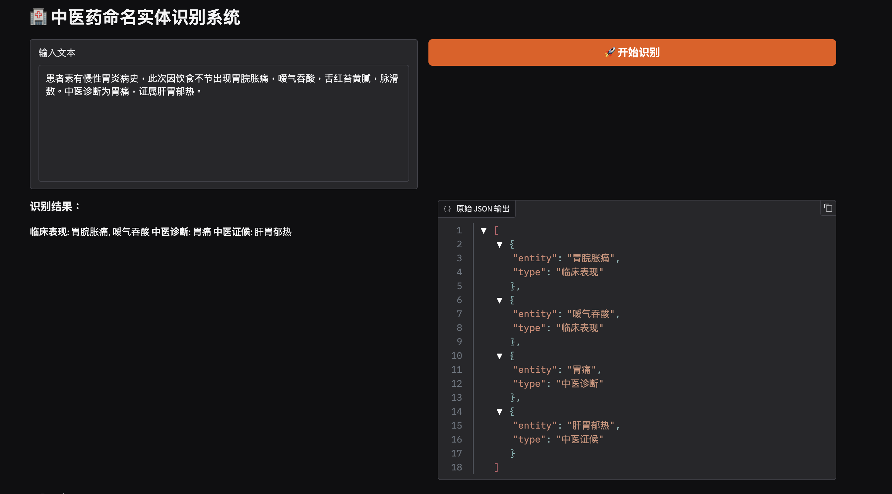

# Traditional Chinese Medicine NER 中医命名实体识别系统

## 项目简介 📖

这是一个利用中医药数据集在qwen-2.5-7b上微调的大语言模型，它能根据对 病情+ 处方的描述，返回结构化的实体和标签数据。经过在六百多条的测试数据上验证，目前的评估因子f1 socre平均得分近0.8【项目代码中有评估代码】。 大家可以在复现本项目后，通过修改模型配置、优化训练参数或改变微调手段等方式继续优化本项目，提高评估因子f1 socres的数值。 

🎉 欢迎改进！

## 执行步骤 🚗

1. 按照必要的依赖包
```shell
pip install -r requirements.txt
```

2. 转换数据为jsonl模型能识别的格式
```shell
python preprocess_data.py
```

3. 开始训练微调

hint: qwen-2.5-7b预训练模型较大，建议提前下载后保存在本地，训练时直接调用；
```shell
python train.py
```

4. 验证和评估模型
```shell
python evaluation.py
```

5.  部署模型及预测
```shell
python app.py
```

## 效果展示 📃

可以直接用游览器打开本地客户端链接，输入中医药内容，命名实体识别结果如下图所示：




